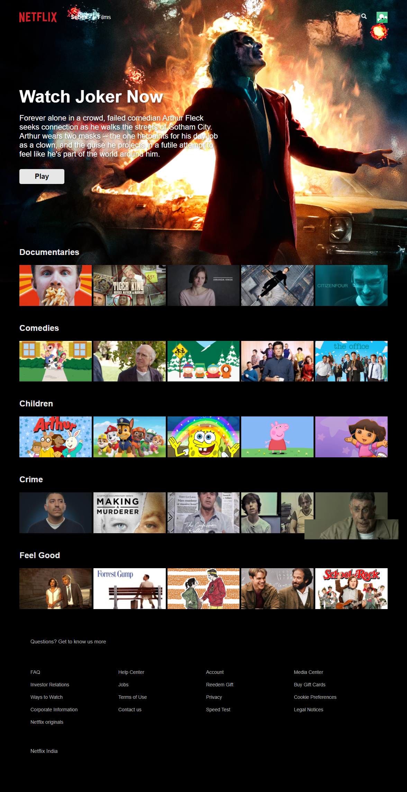

# Portfolio Showcase

Welcome to my portfolio showcase! Here, I'm excited to present two captivating Flutter mobile applications for E-commerce and a visually stunning web app reminiscent of popular streaming platforms like Netflix. Let's dive into the essence of each creation:

## Mobile Apps

### 1. E-commerce Elegance

#### Experience Seamless Shopping
Embark on a seamless shopping journey with our first E-commerce Flutter app. Picture user-friendly profiles, effortless product browsing, and a streamlined checkout process. This app is not just about buying; it's about crafting an experience.

### 2. Unique Shopping Adventure

#### A Different Flavor
The second E-commerce app introduces a fresh perspective. Dive into a world of categorized products, secure payment options, and real-time order updates. It's not just about buying; it's about enjoying a unique shopping adventure.

## Web App

### 3. Cinematic Web Experience

#### Netflix-Like Magic
Imagine a web app that mirrors the magic of Netflix. It's not just about watching; it's about getting lost in a cinematic experience. Our web app offers a seamless interface, personalized profiles, and a recommendation engine tailored to your preferences.

## How to Immerse Yourself

To experience the magic:

### E-commerce Apps

1. **Navigate** to the chosen E-commerce app directory.
2. Run `flutter pub get` to install dependencies.
3. Launch the app using `flutter run`.

### Netflix-like Web App

1. **Navigate** to the Netflix-like Web App directory.
2. Install dependencies using `npm install`.
3. Start the development server with `npm start`.

Feel the excitement, explore the creations, and let your imagination run wild. Your feedback is invaluable, and I'm open to collaboration ideas!

Let the showcase begin! 🚀
